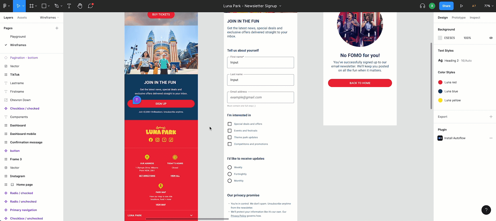
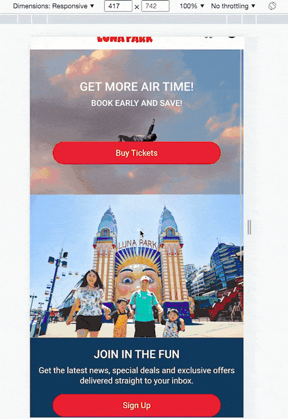

# Mini collaboration between UX & SE

This project was the result of a two-day collaboration with General Assembly UX design student. Our brief was to create a new form for users to sign up for the latest newsletter from our example client, Luna Park. We elected to work with a Vue/Node stack since we were most familiar with Node backends and wanted to stretch ourselves by learning Vue. During the two days, we were also able to deliver a back office site where administrators could view users who have signed up for the newsletter. </br>

Techonology : **_Vue.js, Node.js & Express.js_** </br>
Deplopyment ; **_Heroku & Netlify_** </br>
Demo: https://lunapark-client.netlify.app/

```
Group Member:
DEV: Eric & Mandy
UX: Thomas & Nikesh
```

### Figma file



### Shortcut


